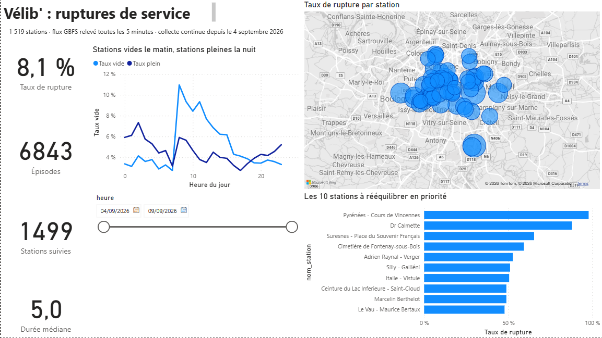
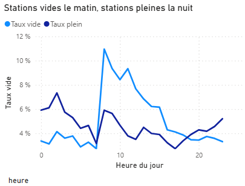
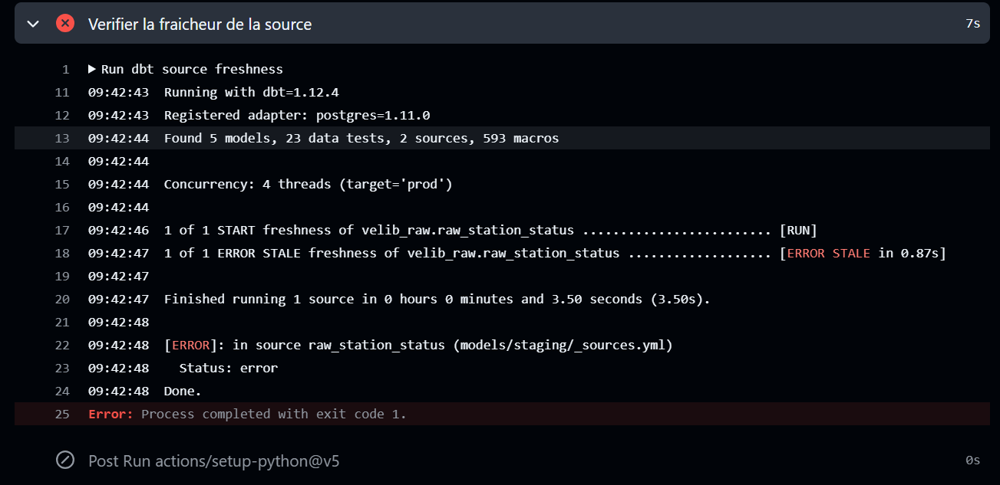

# Vélib' — détection des ruptures de service en libre-service

Produit de données complet et automatisé : collecte continue d'un flux temps réel,
entrepôt Postgres, transformations versionnées et testées avec dbt, orchestration
GitHub Actions, restitution Power BI.

## Le problème

Un opérateur de vélos en libre-service perd une course chaque fois qu'une station est
**vide** — pas de vélo à prendre — ou **pleine** — pas de place pour rendre. Ses camions
de rééquilibrage ne couvrent qu'une fraction du réseau chaque jour.

Sa question n'est donc pas « combien de vélos y a-t-il ? » mais
**« quelles stations rééquilibrer, à quelle heure, et dans quel ordre ? »**

Ce dépôt construit la chaîne qui répond à cette question, sur le réseau Vélib' Métropole
(1 519 stations).

**Le résultat qui sert à décider** : les stations vides sont **deux fois plus fréquentes**
que les stations pleines (4,97 % contre 3,26 % des relevés), et les deux phénomènes ne se
produisent pas au même moment — les stations vides culminent à **9,5 % vers 9 h**, les
stations pleines à **5,5 % vers minuit**. La fenêtre de rééquilibrage optimale n'est donc
pas le matin, quand le problème est visible, mais **la nuit, quand il se forme**.

## Ce qui rend ce projet différent : la donnée n'existait pas

Le flux GBFS de Vélib' ne publie que l'**instantané présent**. Aucun historique n'est
disponible.

Un collecteur exécuté en continu depuis le 4 septembre 2026 construit donc une série
temporelle que personne d'autre ne possède. L'automatisation n'est pas une coquetterie
technique : **c'est la seule raison pour laquelle le jeu de données existe.**

## Aperçu





*Les stations vides dominent la journée, les stations pleines la nuit. Les deux courbes se
croisent vers 18 h et vers 6 h.*

## Architecture

```
Flux GBFS Velib (station_status.json)
        |
        v   ingestion Python, idempotente, horodatee par la source
  Postgres (Neon)      tables brutes, en ajout seul
        |
        v   dbt : staging -> marts, 23 tests, 1 test de fraicheur
  analytics.*          schema en etoile
        |
        v
  Power BI
```


| Workflow | Déclenchement | Rôle |
|---|---|---|
| collecte-velib | toutes les 2 h, boucle de 230 min | relevé du flux toutes les 5 minutes |
| dbt-build | à chaque commit + quotidien | reconstruit les modèles, joue les tests, vérifie la fraîcheur |

## Modélisation

**Staging** : nettoyage, typage, nommage métier, et calcul des états qui font perdre une
course — station vide, station pleine, station réellement exploitée.

**Marts** :

- dim_station — une ligne par station
- fct_station_heure — 74 851 lignes : taux de rupture, de vide et de plein par station et par heure
- fct_episode_rupture — 6 843 épisodes : une série consécutive de relevés en rupture

### Deux décisions de mesure

**On compte des relevés, pas des minutes.** La cadence de collecte est irrégulière (voir
problème 1). Une durée en minutes serait biaisée par les trous d'échantillonnage, alors
qu'une **proportion d'observations** reste juste quelle que soit la cadence.

**Les épisodes sont détectés par *gaps and islands*.** On marque le relevé où la rupture
commence, une somme cumulée numérote les épisodes, un GROUP BY donne début, fin et durée.

## Qualité des données

**23 tests dbt** à chaque commit : unicité et non-nullité des clés, intégrité
référentielle, unicité des combinaisons (station, heure), plages de valeurs, valeurs
autorisées.

**Un test de fraîcheur sur la source** : dbt source freshness alerte au-delà de 3 heures
sans nouveau relevé, échoue au-delà de 12. C'est un test sur le *pipeline*, pas seulement
sur les données. Il a sauvé le projet — voir problème 5.

**Une ingestion idempotente** : l'horodatage vient du flux, pas de l'horloge de la machine.
Avec la clé primaire (snapshot_ts, station_id) et ON CONFLICT DO NOTHING, relancer le
collecteur ne crée aucun doublon. Décidé au premier jour, décisif ensuite.

## Problèmes rencontrés

Les cinq auraient produit des résultats faux — ou aucun résultat — sans lever la moindre
erreur.

### 1. GitHub ne respecte pas les crons courts

Le collecteur était planifié toutes les 10 minutes. Mesure réelle : **30 exécutions en
3 jours et 18 heures**, soit **6 % de ce qui était prévu**. GitHub déprioritise les
planifications courtes.

C'était bloquant : avec un relevé toutes les trois heures, une station vide pendant
quarante minutes est invisible — or c'est précisément l'objet de la mesure.

**Correction — inverser le rapport entre déclenchements et durée.** Plutôt que 144 réveils
par jour, on en demande 12, et chaque exécution collecte pendant 230 minutes. Le
chevauchement volontaire sert de filet ; les doublons sont sans effet grâce à
l'idempotence.

**Couverture mesurée après correction : 54,7 %** (149 relevés pour 270 attendus sur
22 heures). Neuf fois mieux qu'avant, mais toujours pas continu — le chiffre est mesuré,
pas estimé.

### 2. Les stations hors service comptaient comme des ruptures

Une station affichant **0 vélo et 0 place** coche simultanément « vide » et « pleine ».
Elle apparaissait en rupture 100 % du temps sans qu'aucun usager n'ait été gêné.

Après ce premier correctif, seize stations affichaient encore 100 % : capacité normale,
**zéro vélo sur tous les relevés**, toutes les places libres. Des bornes installées mais
jamais approvisionnées — stations neuves, fermées, ou événementielles.

### 3. Une heuristique remplacée par la donnée que la source publiait déjà

Deux stations restaient à 100 % : *Gare du Stade* et *Pyrénées – Cours de Vincennes*, toutes
deux avec des compteurs strictement immobiles sur 149 relevés consécutifs. J'ai d'abord
construit un critère de variation au grain station x jour : une station exploitée fluctue
dans la journée, une station gelée non.

**Ce critère était faux dans les deux sens.** Il laissait passer *Gare du Stade* les jours
où elle avait bougé le matin, et supprimait à tort *Pyrénées* dont le gel avait commencé en
milieu de journée. Un critère calculé par jour ne peut pas couper au milieu d'une journée.

La mesure qui a tranché — sur last_reported et les drapeaux GBFS, jamais exploités
jusque-là :

| | valeurs last_reported | retard moyen | is_renting / is_returning |
|---|---|---|---|
| Gare du Stade | **1** | **762 min** | **0 / 0** |
| Pyrénées – Cours de Vincennes | 25 | 29,5 min | 1 / 1 |

*Gare du Stade* n'a émis qu'une fois en 22 heures et déclare elle-même ne plus louer ni
recevoir : artefact. *Pyrénées* émet normalement et fonctionne : ses 21 vélos sont
réellement là, immobiles — très probablement hors d'usage, ce qui bloque 21 points
d'attache. **C'est du signal métier, et de la meilleure espèce.**

Le périmètre est donc jugé **relevé par relevé** sur is_renting et is_returning
(23 stations écartées), et l'heuristique maison a été supprimée du dépôt. Savoir jeter sa
propre solution quand la source fournit mieux fait partie du travail.

### 4. Les trous de collecte fabriquaient des épisodes de 17 heures

Un épisode était défini comme une série de relevés **consécutifs** en rupture. Or
« consécutif » veut dire « relevé suivant », pas « cinq minutes plus tard ». Une station en
rupture avant et après un trou de trois heures produisait **un seul épisode de trois
heures**, alors qu'elle avait peut-être été réapprovisionnée entre-temps.

Symptôme : une moyenne de 61 minutes contre une médiane de 18, et un maximum à
**1 042 minutes**.

**Correction** : un écart de plus de 15 minutes entre deux relevés rompt la continuité et
démarre un nouvel épisode. Maximum ramené à **136 minutes**, médianes stables à 15,2 min
(pleine) et 20,2 min (vide).

Réserve assumée : ce maximum de 136 minutes est identique pour les deux types de rupture,
à la décimale près. Ce n'est pas une coïncidence — c'est la durée de la plus longue rafale
de collecte. **Les quantiles hauts mesurent ma fenêtre d'observation, pas le phénomène.**
Seule la médiane est interprétable.

### 5. Le pipeline est mort sans qu'aucune exécution ne devienne rouge

Le 9 septembre, la collecte s'est arrêtée net. Aucune alerte, aucune notification.

Cause : une réécriture maladroite avait laissé du script shell dans
.github/workflows/collect.yml. GitHub ne pouvait plus lire le fichier — donc **plus aucune
exécution ne démarrait**. Pas d'exécution en échec à répétition : *l'absence d'exécution*,
et l'absence ne notifie rien.



Ce qui l'a détecté, c'est dbt source freshness, qui a fait échouer le build quotidien
parce que la donnée la plus récente avait plus de 12 heures. **Un test sur la fraîcheur des
données est le seul capteur qui voie une panne d'orchestrateur.** C'est l'argument qui
justifie ce test mieux que n'importe quelle explication théorique.

## Une mesure avant de refactorer

En analysant last_reported, j'ai découvert que **chaque station ne publie un nouvel état
que toutes les 30 à 60 minutes**, alors que je relève toutes les 5 minutes :
223 054 relevés pour seulement **29 740 états réellement publiés**, soit un
**suréchantillonnage de x7,5**. Neuf relevés sur dix sont des copies.

La tentation était de tout recalculer au grain « état publié ». Avant de refactorer, j'ai
mesuré l'impact sur le résultat final :

| Base de calcul | Taux de rupture |
|---|---|
| par relevé | 8,230 % |
| par état publié | 8,366 % |

**0,14 point d'écart.** Répéter un état pendant qu'il dure revient à le pondérer par sa
durée, ce qui est exactement la mesure voulue. Le modèle n'a donc pas été touché.

Si les deux chiffres avaient divergé, cela aurait signifié que ma cadence de collecte est
corrélée à l'état des stations — un biais autrement plus grave. Elle ne l'est pas.

## Résultats

| | |
|---|---|
| Stations du réseau | 1 519 |
| Stations retenues | 1 499 |
| Écartées : hors service (drapeaux GBFS) | 23 |
| Écartées : jamais approvisionnées | 16 |
| Couples station-heure | 74 851 |
| Épisodes de rupture | 6 843 |
| Taux de rupture réseau | **8,23 %** (vide 4,97 % / pleine 3,26 %) |

### Les stations à rééquilibrer en priorité

| Station | Taux | Type |
|---|---|---|
| Pyrénées – Cours de Vincennes | 100 % | pleine |
| Dr Calmette | 94,4 % | pleine |
| Suresnes – Place du Souvenir Français | 77,3 % | vide |
| Cimetière de Fontenay-sous-Bois | 70,7 % | vide |
| Italie – Vistule | 60,8 % | vide |

*Pyrénées – Cours de Vincennes* est en haut de la colline de Belleville ; les stations
vides sont en périphérie et en petite couronne. C'est le comportement connu des systèmes de
vélos partagés — on descend les collines sans les remonter, on rentre vers le centre le
matin sans repartir en banlieue — et le modèle le retrouve seul, à partir de compteurs
bruts. **Un modèle qui redécouvre une régularité physique connue mesure la bonne chose.**

### La recommandation opérationnelle

Le taux de stations pleines monte lentement de 17 h à minuit et culmine **au milieu de la
nuit**, pas à l'heure de pointe du soir. Ce n'est pas un flux, c'est une accumulation : le
soir, les vélos arrivent quelque part et plus rien ne les enlève.

D'où : **rééquilibrer entre minuit et 5 h**, quand les stations saturées sont les plus
nombreuses, les plus faciles à identifier, et qu'aucun trafic ne défait le travail. Le pic
de stations vides à 9 h est la conséquence de ne pas l'avoir fait.

## Limites assumées

**Couverture partielle.** 54,7 % de la cadence nominale sur la fenêtre de référence. Mesuré,
pas estimé.

**Profil horaire sur une occurrence par heure.** Sur la fenêtre à cadence nominale, chaque
heure de la journée n'est observée qu'une fois. Le profil est cohérent, mais ce n'est pas
encore une régularité établie. Il se consolidera avec l'accumulation.

**Résolution temporelle réelle : environ 30 minutes**, imposée par la fréquence de
publication de la source, pas par ma cadence de collecte.

**Quantiles hauts non interprétables** : bornés par la durée des rafales de collecte
(voir problème 4).

**Fin d'épisode estimée** au relevé suivant, dans la limite du seuil de 15 minutes.

**Une seule ville.** Les régularités observées (collines, périphérie) sont propres à la
topographie parisienne.

## Prochaines étapes

**Prévision du décrochage** : à partir de plusieurs semaines d'historique, prédire la
probabilité qu'une station tombe en rupture dans les deux heures. La table d'apprentissage
se construit sur fct_station_heure, avec les mêmes précautions de non-fuite que dans mon
projet de scoring crédit.

**Comparaison inter-réseaux** : le standard GBFS étant partagé, la même chaîne s'applique à
Lyon, Nantes ou Bruxelles en changeant une URL. Comparer les profils entre villes de
topographies différentes isolerait ce qui relève du relief et ce qui relève de
l'exploitation.

**Alertes** : notifier quand une station dépasse un seuil, plutôt qu'attendre une
consultation du tableau de bord.

## Structure du dépôt

```
velib-monitoring/
  ingestion/collect.py        collecteur GBFS, idempotent, mode boucle
  velib_dbt/models/
    staging/                  sources declarees, nettoyage, tests
    marts/                    dimension, faits, tests
  ci/make_profiles.py         profil dbt genere depuis le secret
  .github/workflows/          collecte + rebuild et tests
  powerbi/velib.pbix          tableau de bord
  docs/                       lignage dbt, captures
  explore.py                  requetes d exploration
```

### Reproduire

```bash
pip install -r requirements.txt
python ingestion/collect.py

pip install dbt-core dbt-postgres
cd velib_dbt && dbt deps && dbt build && dbt source freshness
```

Le collecteur crée son schéma lui-même : aucune étape manuelle en base.

---

Données : [Vélib' Métropole — open data GBFS](https://www.velib-metropole.fr/donnees-open-data-gbfs-du-service-velib-metropole),
sous Licence Ouverte.