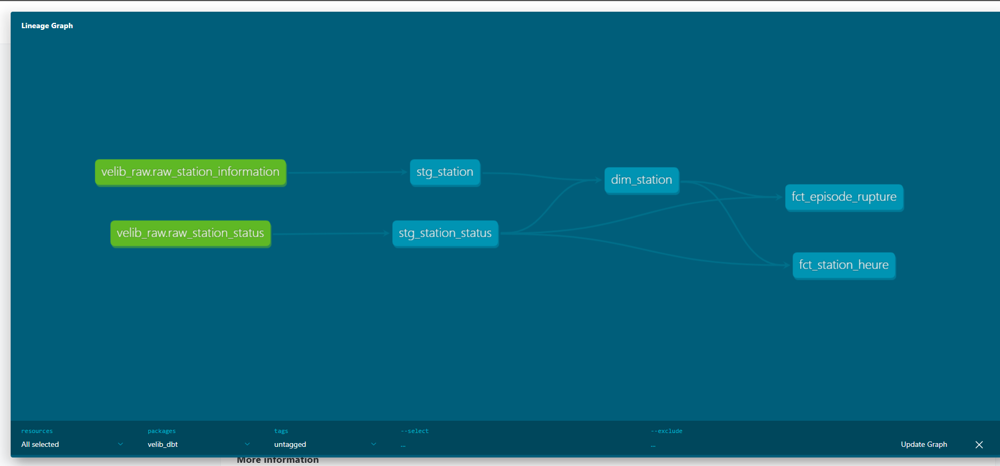

# Vélib' — détection des ruptures de service en libre-service

Produit de données complet et automatisé : collecte continue d'un flux temps réel,
entrepôt Postgres, transformations versionnées et testées avec dbt, orchestration
GitHub Actions, restitution décisionnelle.

## Le problème

Un opérateur de vélos en libre-service perd une course à chaque fois qu'une station
est **vide** — pas de vélo à prendre — ou **pleine** — pas de place pour rendre.
Ses camions de rééquilibrage ne peuvent couvrir qu'une fraction du réseau chaque jour.

Sa question n'est donc pas « combien de vélos y a-t-il ? » mais
**« quelles stations rééquilibrer, à quelle heure, et dans quel ordre ? »**

Ce dépôt construit la chaîne qui répond à cette question, sur le réseau Vélib'
Métropole (1 519 stations).

## Ce qui rend ce projet différent : la donnée n'existait pas

Le flux GBFS de Vélib' ne publie que l'**instantané présent** — combien de vélos et de
places libres, station par station, maintenant. Aucun historique n'est disponible.

Un collecteur exécuté en continu depuis le 4 septembre 2026 construit donc une série
temporelle que personne d'autre ne possède. L'automatisation n'est pas une coquetterie
technique : **c'est la seule raison pour laquelle le jeu de données existe.**

## Architecture

```
Flux GBFS Vélib' (station_status.json, mis à jour chaque minute)
        │
        ▼   ingestion Python, idempotente, horodatée par la source
  Postgres (Neon)      tables brutes, en ajout seul
        │
        ▼   dbt : staging → marts, 20 tests, documentation générée
  analytics.*          schéma en étoile
        │
        ▼
  Restitution décisionnelle
```



*Lignage généré par dbt : deux sources brutes, deux modèles de staging, une dimension
et deux tables de faits. `dim_station` alimente les deux faits — c'est elle qui porte
le périmètre des stations réellement exploitées.*

Deux workflows GitHub Actions tournent en autonomie :

| Workflow | Déclenchement | Rôle |
|---|---|---|
| `collecte-velib` | toutes les 2 h, boucle de 130 min | relevé du flux toutes les 5 minutes |
| `dbt-build` | à chaque commit + quotidien | reconstruit les modèles, joue les 20 tests, vérifie la fraîcheur |

## Modélisation

**Staging** (`stg_station_status`, `stg_station`) : nettoyage, typage, nommage métier,
et calcul des deux états qui font perdre une course — station vide, station pleine.

**Marts** :

- `dim_station` — une ligne par station, avec l'indicateur `est_en_exploitation`
- `fct_station_heure` — taux de rupture par station et par heure
- `fct_episode_rupture` — un épisode = une série consécutive de relevés en rupture

### Deux décisions de mesure

**On compte des relevés, pas des minutes.** La cadence de collecte est irrégulière
(voir « Problèmes rencontrés »). Une durée en minutes serait donc biaisée par les
trous d'échantillonnage, alors qu'une **proportion d'observations** reste juste quelle
que soit la cadence. Le taux de rupture est défini comme la part des relevés où la
station est vide ou pleine.

**Les épisodes sont détectés par *gaps and islands*.** On marque le relevé où la
rupture commence — en rupture maintenant, pas au relevé précédent — puis une somme
cumulée de ces marqueurs numérote les épisodes. Tous les relevés d'un même épisode
partagent le même numéro, et un `GROUP BY` donne début, fin et durée. La fin est
estimée par le relevé suivant : on ne sait pas à quelle minute exacte la rupture a
cessé, seulement qu'elle avait cessé à ce moment-là.

## Qualité des données

**20 tests dbt** s'exécutent à chaque commit : unicité et non-nullité des clés,
intégrité référentielle entre les faits et la dimension, plages de valeurs acceptées,
valeurs autorisées sur les colonnes catégorielles.

**Un test de fraîcheur sur la source** : `dbt source freshness` alerte si le dernier
relevé date de plus de 3 heures, échoue au-delà de 12. C'est un test sur le *pipeline*,
pas seulement sur les données — il détecte l'arrêt du collecteur avant que le tableau
de bord ne mente silencieusement.

**Une ingestion idempotente** : l'horodatage d'un relevé vient du champ `last_updated`
du flux, pas de l'horloge de la machine. Combiné à la clé primaire
`(snapshot_ts, station_id)` et à `ON CONFLICT DO NOTHING`, relancer le collecteur ne
crée aucun doublon. Cette propriété, décidée dès le premier jour, s'est révélée
décisive plus tard (voir problème 1).

## Problèmes rencontrés

Les trois auraient produit des résultats faux sans lever la moindre erreur.

### 1. GitHub ne respecte pas les crons courts

Le collecteur était planifié toutes les 10 minutes. Mesure réelle sur les premiers
jours : **30 exécutions en 3 jours et 18 heures**, soit une toutes les 2 à 4 heures —
**6 % de ce qui était prévu**. GitHub ne garantit pas les planifications courtes et
les déprioritise en période de charge.

C'était bloquant : avec un relevé toutes les trois heures, une station vide pendant
quarante minutes est totalement invisible, alors que c'est précisément l'objet de la
mesure.

**Correction — inverser le rapport entre déclenchements et durée.** Plutôt que
demander 144 réveils par jour, on en demande 12, et chaque exécution collecte pendant
130 minutes avec un relevé toutes les 5 minutes. Le chevauchement volontaire
(130 minutes de collecte pour un déclenchement toutes les 120) sert de filet : si un
cron saute, le suivant couvre le trou. Les doublons ainsi créés sont sans effet,
grâce à l'idempotence.

### 2. Les stations hors service comptaient comme des ruptures

Une station affichant **0 vélo et 0 place** coche simultanément « vide » et « pleine ».
Elle apparaissait donc en rupture 100 % du temps sans qu'aucun usager n'ait jamais été
gêné. Le discriminant : une vraie station pleine a des vélos, une vraie station vide a
des places — seule une station hors service a zéro des deux.

### 3. Seize stations n'ont jamais été approvisionnées

Après correction du point 2, treize stations affichaient encore un taux de 100 % sur
la totalité de la période. Le diagnostic est venu du profil des compteurs :

```
Quai de l'Horloge - Pont Neuf   capacité 17    vélos 0→0   places 17→17
Mairie du 3ème                  capacité 32    vélos 0→0   places 32→32
Station Tour de France          capacité 204   vélos 0→0   places 200→200
```

**Zéro vélo sur tous les relevés**, et toutes les places libres. Bornes installées mais
jamais approvisionnées : stations neuves, fermées, ou événementielles. Ce ne sont pas
des ruptures au sens métier — personne n'enverra un camion à une station sans vélos
depuis quatre jours.

Ni `is_installed`, ni la capacité, ni le test du point 2 ne le disaient. **Le bon
discriminant est la variation** : une station exploitée fluctue, une station inactive
ne bouge jamais. `dim_station.est_en_exploitation` retient les stations ayant eu au
moins un vélo *et* au moins une place libre sur la période.

## Premiers résultats

*État au 8 septembre 2026, après 4 jours de collecte à cadence dégradée
(voir problème 1). Ces chiffres seront réévalués sur une période à cadence nominale.*

| | |
|---|---|
| Stations suivies | 1 519 |
| Stations retenues (exploitées) | 1 503 |
| Couples station-heure | 48 032 |
| Épisodes de rupture détectés | 2 429 |
| dont stations vides / pleines | 1 446 / 983 |

### Le modèle retrouve une régularité connue

Les stations les plus souvent en rupture :

| Station | Taux de rupture |
|---|---|
| Pyrénées – Cours de Vincennes | 87,5 % |
| Place Alphonse Deville | 81,3 % |
| Pavé des Gardes – Charles Vaillant | 68,8 % |
| Parc Roger Salengro | 65,6 % |
| Adrien Raynal – Verger | 56,3 % |

*Pyrénées – Cours de Vincennes* est en haut de la colline de Belleville. Les autres
sont en périphérie ou en petite couronne. C'est exactement le comportement connu des
systèmes de vélos partagés — on descend les collines sans les remonter, on rentre vers
le centre le matin sans repartir en banlieue — et le modèle le retrouve seul, à partir
de compteurs bruts. **Un modèle qui redécouvre une régularité physique connue mesure
la bonne chose.**

Le profil horaire va dans le même sens : **15,9 % de ruptures à 7 h** contre **4,5 % à
6 h**. Le pic arrive avec l'heure de pointe du matin, une heure après le creux.

## Limites assumées

**Cadence dégradée sur la première période.** Les quatre premiers jours ont été
collectés à raison d'un relevé toutes les 2 à 4 heures. Les durées d'épisodes sont donc
surestimées sur cette fenêtre, et certaines heures de la journée ne sont pas
représentées. Corrigé depuis.

**Fin d'épisode estimée.** La rupture est réputée avoir cessé au relevé suivant. La
précision de la durée est donc bornée par la cadence de collecte.

**Périmètre d'exploitation.** Le critère « au moins un vélo observé » ne distingue pas
parfaitement une station jamais approvisionnée d'une station en rupture chronique. Il
tranche ici parce que les seize cas sont à zéro absolu, mais il devra être réévalué sur
une période plus longue.

**Une seule ville.** Les régularités observées (collines, périphérie) sont propres à la
topographie parisienne.

## Prochaines étapes

**Tableau de bord opérationnel** : liste priorisée des stations à rééquilibrer, carte
des taux par station, profil horaire — la restitution qui transforme la mesure en
décision.

**Prévision du décrochage** : à partir de plusieurs semaines d'historique, prédire la
probabilité qu'une station tombe en rupture dans les deux heures. La table
d'apprentissage se construit sur `fct_station_heure`, avec les mêmes précautions de
non-fuite que dans mon projet de scoring crédit.

**Comparaison inter-réseaux** : le standard GBFS étant partagé, la même chaîne
s'applique à Lyon, Nantes ou Bruxelles en changeant une URL. Comparer les profils de
rupture entre villes de topographies différentes isolerait ce qui relève du relief et
ce qui relève de l'exploitation.

**Alertes** : notifier quand une station dépasse un seuil de rupture, plutôt
qu'attendre une consultation du tableau de bord.

## Structure du dépôt

```
velib-monitoring/
├── ingestion/
│   └── collect.py              collecteur GBFS, idempotent, mode boucle
├── velib_dbt/
│   ├── models/
│   │   ├── staging/            sources déclarées, nettoyage, tests
│   │   └── marts/              dimension, faits, tests
│   ├── dbt_project.yml
│   └── packages.yml
├── ci/
│   └── make_profiles.py        profil dbt généré depuis le secret
├── .github/workflows/
│   ├── collect.yml             collecte en boucle
│   └── dbt.yml                 rebuild + tests à chaque commit
├── docs/
│   └── lignage.png
└── explore.py                  requêtes d'exploration
```

### Reproduire

Prérequis : Python 3.11+, une base Postgres, la variable `DATABASE_URL`.

```bash
pip install -r requirements.txt
python ingestion/collect.py          # crée les tables et fait un relevé

pip install dbt-core dbt-postgres
cd velib_dbt && dbt deps && dbt build
```

Le collecteur crée son schéma lui-même : aucune étape manuelle en base.

---

Données : [Vélib' Métropole — open data GBFS](https://www.velib-metropole.fr/donnees-open-data-gbfs-du-service-velib-metropole),
sous Licence Ouverte.